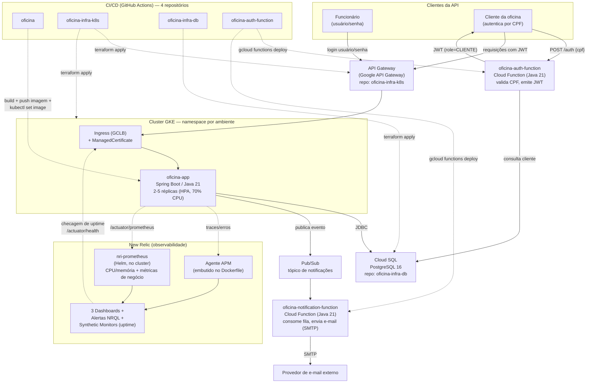

# Diagrama de Componentes — Fase 3

Visão geral de todas as peças do sistema em nuvem (GCP) e como se conectam. Cada ambiente
(homologação/produção) tem sua própria instância de cada componente dentro do mesmo projeto GCP —
o diagrama abaixo mostra um ambiente para não duplicar visualmente.

## Legenda

- **Linha sólida**: chamada síncrona (HTTP/JDBC).
- **Linha pontilhada**: comunicação assíncrona/observação (deploy, métricas, healthcheck).
- Cada repositório de infraestrutura (`oficina-infra-k8s`, `oficina-infra-db`) provisiona sua parte
  via Terraform; `oficina` e `oficina-auth-function` publicam artefatos (imagem Docker / functions)
  que o Kubernetes/Cloud Functions passam a rodar.

## Relacionado

- [`docs/arquitetura/diagrama-sequencia.md`](diagrama-sequencia.md) — o passo a passo de duas
  interações específicas (autenticação por CPF e abertura de OS).
- [`docs/arquitetura/infraestrutura.md`](infraestrutura.md) — decisões técnicas de cada componente.
- [`docs/arquitetura/hexagonal.md`](hexagonal.md) — o que tem *dentro* do componente `oficina-app`.
