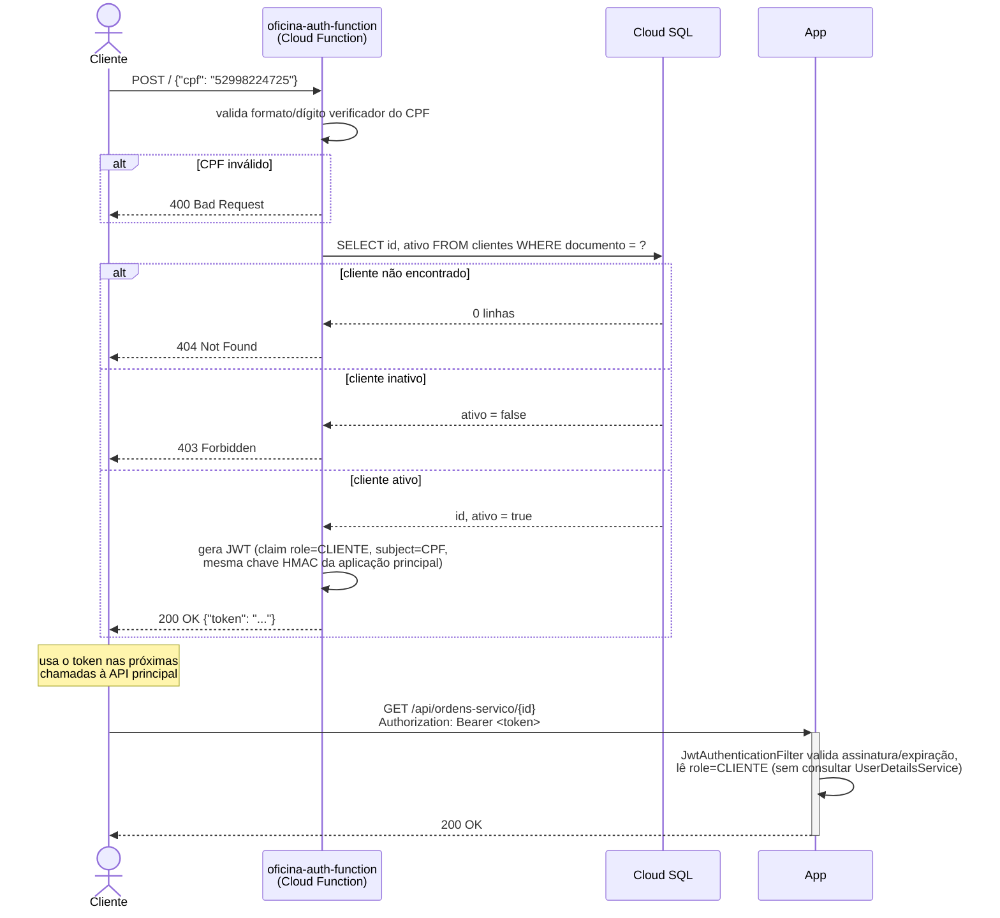
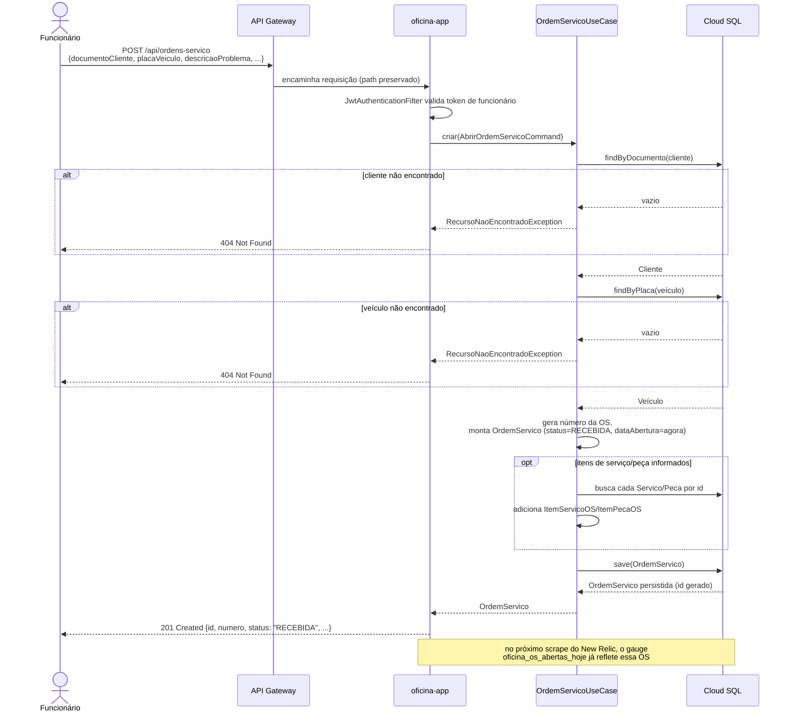

# Diagramas de Sequência — Fase 3

## 1. Autenticação de um cliente por CPF

Fluxo do endpoint serverless `oficina-auth-function` (repositório dedicado) — diferente do login de
funcionário (usuário/senha), que acontece direto na aplicação principal (`/api/auth/login`).

## 2. Abertura de uma Ordem de Serviço

Fluxo de `POST /api/ordens-servico`, do funcionário autenticado até a OS persistida.

## Relacionado

- [`docs/arquitetura/diagrama-componentes.md`](diagrama-componentes.md) — visão estática de todos os
  componentes envolvidos.
- [`docs/rfcs/003-estrategia-autenticacao.md`](../rfcs/003-estrategia-autenticacao.md) — por que a
  autenticação por CPF é uma function separada em vez de um endpoint na aplicação principal.
