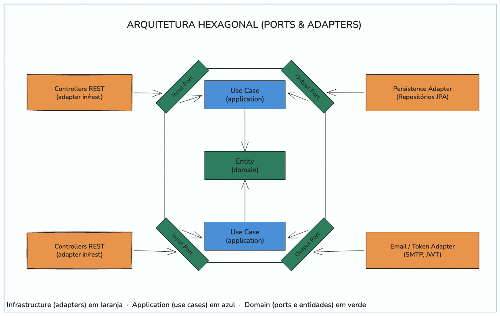
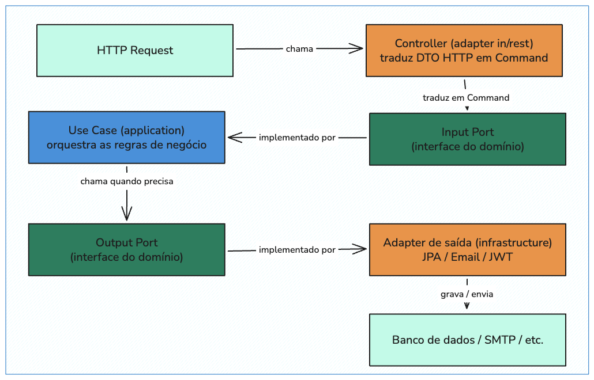

# Arquitetura Hexagonal (Ports & Adapters)

## O que é

A partir da Fase 2, o projeto migrou da Arquitetura MVC para a **Arquitetura Hexagonal** (também
conhecida como Ports & Adapters). O domínio ocupa o centro da aplicação e não depende de nenhuma
outra camada; toda comunicação com o mundo externo (HTTP, banco de dados, e-mail) passa por
interfaces (**ports**) implementadas por classes de infraestrutura (**adapters**).

**Regra fundamental de dependência:** as dependências sempre apontam para dentro.
Infraestrutura depende de Application, Application depende de Domain — nunca o contrário.
O Domain não conhece Spring, JPA, HTTP ou qualquer framework externo.

---

## Diagrama das Camadas



```
┌─────────────────────────────────────────────────────────────────────┐
│  INFRASTRUCTURE (Adapters)                                          │
│                                                                     │
│  ┌───────────────────────────────────────────────────────────────┐  │
│  │  APPLICATION (Use Cases)                                      │  │
│  │                                                               │  │
│  │  ┌─────────────────────────────────────────────────────────┐  │  │
│  │  │  DOMAIN (Model + Ports)                                 │  │  │
│  │  │  Entidades · Value Objects · Exceções · Interfaces      │  │  │
│  │  └─────────────────────────────────────────────────────────┘  │  │
│  │                                                               │  │
│  └───────────────────────────────────────────────────────────────┘  │
│                                                                     │
└─────────────────────────────────────────────────────────────────────┘
```

---

## Estrutura de Pacotes

```
src/main/java/br/com/fiap/challange/oficina/
├── domain/
│   ├── model/               # Modelos de domínio (POJOs puros) e Value Objects
│   │   ├── enums/           # StatusOS, TipoDocumento
│   │   ├── AuthToken.java   # Record (Value Object)
│   │   ├── Estatisticas.java # Record (Value Object)
│   │   └── (demais modelos de domínio)
│   ├── port/
│   │   ├── in/              # Input Ports (interfaces dos casos de uso)
│   │   │   ├── command/     # Comandos (records imutáveis por caso de uso)
│   │   │   └── (AuthInputPort, ClienteInputPort, ...)
│   │   └── out/             # Output Ports (interfaces de repositórios e serviços externos)
│   │       ├── ClienteRepositoryPort.java
│   │       ├── EmailPort.java
│   │       ├── TokenPort.java
│   │       └── (demais repositórios)
│   ├── exception/           # Exceções de domínio
│   └── validator/           # CpfCnpjValidator, PlacaValidator
├── application/
│   └── usecase/             # Implementações dos casos de uso
│       ├── AuthUseCase.java
│       ├── ClienteUseCase.java
│       ├── OrdemServicoUseCase.java
│       └── (demais use cases)
├── infrastructure/
│   ├── adapter/
│   │   ├── in/rest/         # Controllers REST (Adapters de entrada)
│   │   └── out/
│   │       ├── persistence/ # Adapters de saída (Repositórios JPA + mapeamento domínio↔entidade)
│   │       │   ├── entity/  # Entidades JPA (*JpaEntity) — só aqui existe @Entity/@Column/@ManyToOne
│   │       │   ├── mapper/  # Mappers MapStruct (*Mapper) — convertem domínio ↔ entidade JPA
│   │       │   └── (*JpaRepository + *RepositoryAdapter)
│   │       └── email/       # Adaptadores de e-mail
│   ├── config/               # SecurityConfig, OpenApiConfig, DataInitializer
│   ├── filter/               # CorrelationIdFilter
│   └── security/             # JwtService, JwtAuthenticationFilter, UserDetailsServiceImpl
└── dto/                      # DTOs de entrada/saída (camada de infraestrutura HTTP)
    ├── request/
    └── response/
```

---

## Responsabilidades por Camada

### Domain (Model + Ports)

- Contém os modelos de domínio (POJOs puros, sem `@Entity`/`@Column`/`@ManyToOne` ou qualquer anotação
  JPA/Hibernate), os Value Objects (`AuthToken`, `Estatisticas`) e os enums (`StatusOS`, `TipoDocumento`)
- Encapsula as regras de negócio no próprio modelo (ex: `OrdemServico.transicionarStatus()`, `StatusOS.podeTransicionarPara()`)
- Define os **Input Ports** (`ClienteInputPort`, `OrdemServicoInputPort`, ...) — contratos dos casos de uso
- Define os **Commands** em `port/in/command/` — records imutáveis que representam a intenção de cada operação (ex: `AbrirOrdemServicoCommand`)
- Define os **Output Ports** (`ClienteRepositoryPort`, `EmailPort`, `TokenPort`, ...) — contratos que a infraestrutura deve implementar
- Não depende de nenhuma outra camada, nem de frameworks externos — a persistência (JPA/Hibernate) vive
  exclusivamente em `infrastructure/adapter/out/persistence/entity`, isolada por um mapper MapStruct

### Application (Use Cases)

- Implementa os Input Ports (ex: `ClienteUseCase implements ClienteInputPort`)
- Orquestra as regras de negócio, chama os Output Ports quando precisa persistir dados ou acionar serviços externos
- Gerencia transações (`@Transactional`)
- Depende apenas do Domain (das interfaces dos ports, nunca de uma implementação concreta)

### Infrastructure (Adapters)

- **Adapters de entrada** (`adapter/in/rest`): Controllers REST recebem o DTO HTTP, traduzem para um Command e chamam o Input Port correspondente
- **Adapters de saída** (`adapter/out/persistence`): cada Output Port de repositório é implementado por uma
  classe `*RepositoryAdapter` (ex: `ClienteRepositoryAdapter implements ClienteRepositoryPort`), que compõe
  um `JpaRepository<XJpaEntity, Long>` interno (`entity/` para a entidade JPA) e um `*Mapper` MapStruct
  (`mapper/`) para converter domínio ↔ entidade JPA a cada chamada. A entidade JPA e o repositório Spring
  Data são package-private — só o Port (interface de domínio) e o Adapter são conhecidos fora do pacote
  `persistence`
- **Adapters de saída** (`adapter/out/email`): `JavaMailSenderEmailAdapter` (produção, via Mailpit/SMTP) e `NoOpEmailAdapter` (testes) implementam `EmailPort`
- `JwtService` implementa `TokenPort` — gera e valida tokens JWT HS256
- `config/`, `filter/` e demais classes de infraestrutura (Spring Security, OpenAPI, `CorrelationIdFilter`) completam esta camada

---

## Fluxo de Dependências

```
Infrastructure → Application → Domain
```

- O Domain não depende de nada
- O Application depende apenas das interfaces do Domain (Input/Output Ports)
- A Infrastructure implementa os Output Ports do Domain e consome os Input Ports do Application

---

## Fluxo de uma Requisição, de Ponta a Ponta



```
HTTP Request
   │
   ▼
Controller (adapter in/rest)
   │  traduz o DTO HTTP em um Command imutável
   ▼
Input Port (interface do domínio)
   │  implementado por
   ▼
Use Case (application)
   │  orquestra as regras de negócio do domínio
   │  chama um Output Port quando precisa persistir ou notificar
   ▼
Output Port (interface do domínio)
   │  implementado por
   ▼
Adapter de saída (infrastructure: JPA / Email / JWT)
   │
   ▼
Banco de dados / SMTP / etc.
```

O caminho de resposta percorre o mesmo fluxo em sentido inverso: o Adapter retorna ao Use Case,
que retorna ao Controller, que converte o resultado em DTO de resposta.

---

## Tabela de Componentes por Bounded Context

| Bounded Context      | Adapter REST (in)        | Input Port              | Use Case              | Output Ports (out)                                                                |
|----------------------|---------------------------|--------------------------|------------------------|-------------------------------------------------------------------------------------|
| Clientes e Veículos  | `ClienteController`      | `ClienteInputPort`      | `ClienteUseCase`      | `ClienteRepositoryPort`                                                           |
|                      | `VeiculoController`      | `VeiculoInputPort`      | `VeiculoUseCase`      | `VeiculoRepositoryPort`, `ClienteRepositoryPort`                                  |
| Ordens de Serviço    | `OrdemServicoController` | `OrdemServicoInputPort` | `OrdemServicoUseCase` | `OrdemServicoRepositoryPort`, `ClienteRepositoryPort`, `VeiculoRepositoryPort`, `ServicoRepositoryPort`, `PecaRepositoryPort`, `EmailPort` |
| Catálogo de Serviços | `ServicoController`      | `ServicoInputPort`      | `ServicoUseCase`      | `ServicoRepositoryPort`                                                           |
| Estoque de Peças     | `PecaController`         | `PecaInputPort`         | `PecaUseCase`         | `PecaRepositoryPort`                                                              |
| Identidade e Acesso  | `AuthController`         | `AuthInputPort`         | `AuthUseCase`         | `UsuarioRepositoryPort`, `TokenPort`                                              |

---

## Tabela de Ports e suas Implementações

| Port | Direção | Implementação |
|---|---|---|
| `ClienteInputPort` | Input | `ClienteUseCase` |
| `VeiculoInputPort` | Input | `VeiculoUseCase` |
| `OrdemServicoInputPort` | Input | `OrdemServicoUseCase` |
| `ServicoInputPort` | Input | `ServicoUseCase` |
| `PecaInputPort` | Input | `PecaUseCase` |
| `AuthInputPort` | Input | `AuthUseCase` |
| `ClienteRepositoryPort` | Output | `ClienteRepositoryAdapter` (via `ClienteJpaRepository` + `ClienteMapper`) |
| `VeiculoRepositoryPort` | Output | `VeiculoRepositoryAdapter` (via `VeiculoJpaRepository` + `VeiculoMapper`) |
| `OrdemServicoRepositoryPort` | Output | `OrdemServicoRepositoryAdapter` (via `OrdemServicoJpaRepository` + `OrdemServicoMapper`) |
| `ServicoRepositoryPort` | Output | `ServicoRepositoryAdapter` (via `ServicoJpaRepository` + `ServicoMapper`) |
| `PecaRepositoryPort` | Output | `PecaRepositoryAdapter` (via `PecaJpaRepository` + `PecaMapper`) |
| `UsuarioRepositoryPort` | Output | `UsuarioRepositoryAdapter` (via `UsuarioJpaRepository` + `UsuarioMapper`) |
| `EmailPort` | Output | `JavaMailSenderEmailAdapter` (produção) / `NoOpEmailAdapter` (testes) |
| `TokenPort` | Output | `JwtService` |

---

## Benefícios Aplicados neste Projeto

1. **Testabilidade isolada do domínio:** o domínio e os use cases podem ser testados com mocks
   simples dos Output Ports (interfaces), sem subir contexto Spring, banco de dados ou servidor SMTP.
2. **Inversão de dependência:** o domínio define os contratos (ports); a infraestrutura é quem
   depende do domínio para implementá-los — nunca o inverso.
3. **Substituibilidade de adapters:** trocar o provedor de e-mail (`JavaMailSenderEmailAdapter` →
   `NoOpEmailAdapter` em testes) ou o mecanismo de persistência não exige alterar nenhuma regra de
   negócio, pois ambos dependem apenas do `EmailPort`/`RepositoryPort`.
4. **Manutenibilidade:** cada camada tem uma responsabilidade clara; fácil localizar onde cada tipo
   de lógica reside (regra de negócio → domain/application; detalhe técnico → infrastructure).
5. **Domínio protegido de frameworks:** alterações em Spring, JPA ou bibliotecas de infraestrutura
   não propagam para as regras de negócio.
