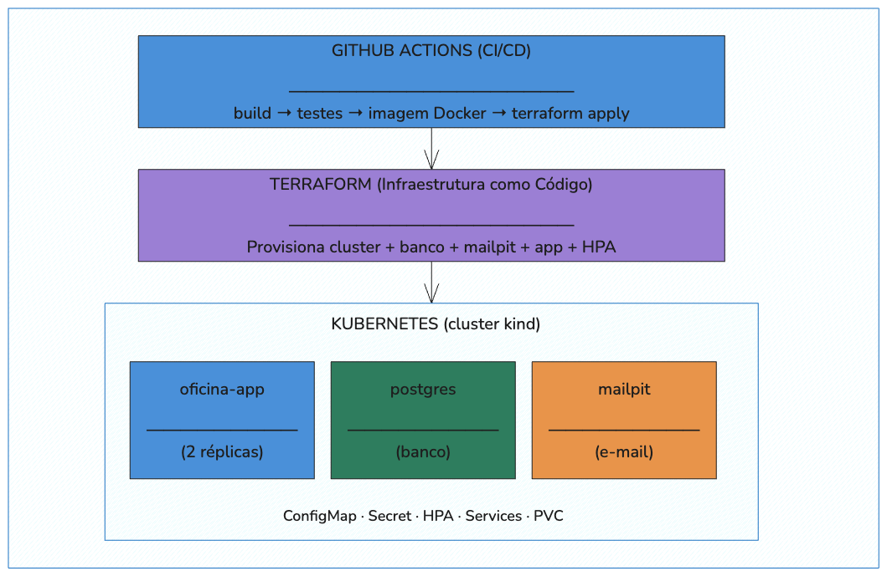
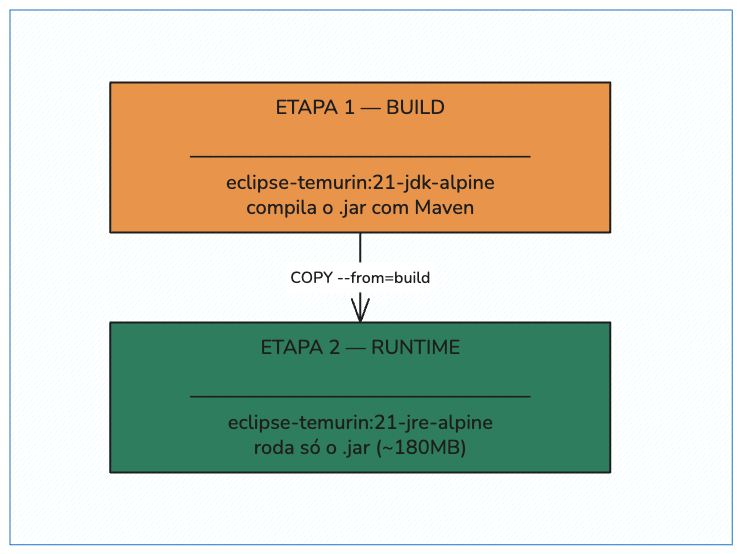
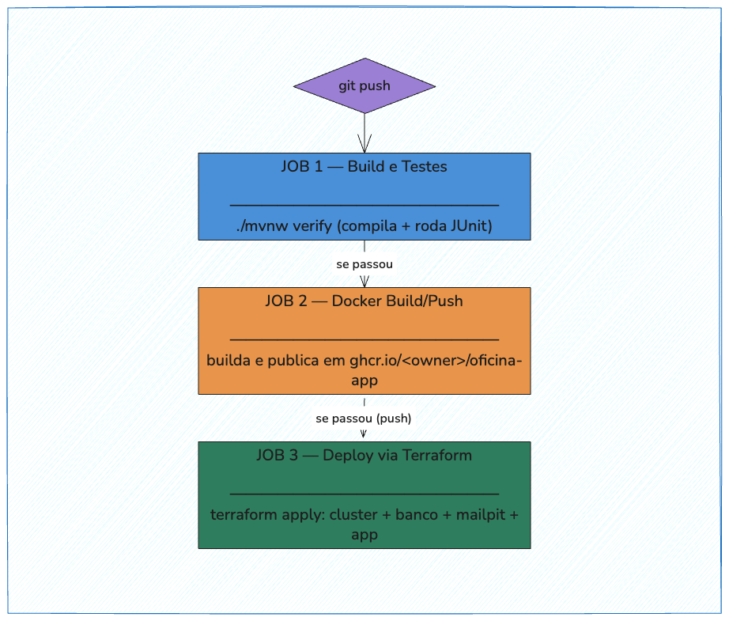

# Especificação de Infraestrutura — Oficina Mecânica
## Fase 2 — Docker, Kubernetes, Terraform e CI/CD

> Este documento descreve o que foi construído na infraestrutura do projeto, por que cada decisão
> técnica foi tomada, e como executar e verificar cada parte funcionando na prática.

---

## Índice

1. [Visão Geral](#1-visão-geral)
2. [Docker e docker-compose](#2-docker-e-docker-compose)
3. [Kubernetes — manifestos em `k8s/`](#3-kubernetes--manifestos-em-k8s)
4. [Terraform — infraestrutura como código em `infra/`](#4-terraform--infraestrutura-como-código-em-infra)
5. [CI/CD — GitHub Actions](#5-cicd--github-actions)
6. [Decisões técnicas e trade-offs](#6-decisões-técnicas-e-trade-offs)
7. [Instalação das ferramentas por sistema operacional](#7-instalação-das-ferramentas-por-sistema-operacional)
8. [Como executar — passo a passo](#8-como-executar--passo-a-passo)
9. [Testando o fluxo de e-mail](#9-testando-o-fluxo-de-e-mail)
10. [Troubleshooting — incidentes reais já enfrentados](#10-troubleshooting--incidentes-reais-já-enfrentados)
11. [Comandos de referência rápida](#11-comandos-de-referência-rápida)

---

## 1. Visão Geral

### O que foi construído



```
┌─────────────────────────────────────────────────────────────┐
│                    GitHub Actions (CI/CD)                    │
│   build → testes → imagem Docker → terraform apply           │
└──────────────────────────┬──────────────────────────────────┘
                           │
┌──────────────────────────▼──────────────────────────────────┐
│              Terraform (Infraestrutura como Código)          │
│    Provisiona cluster + banco + mailpit + app + HPA          │
└──────────────────────────┬──────────────────────────────────┘
                           │
┌──────────────────────────▼──────────────────────────────────┐
│                Kubernetes (cluster kind)                      │
│                                                              │
│  ┌──────────────┐  ┌──────────────┐  ┌──────────────┐      │
│  │  oficina-app │  │  postgres    │  │   mailpit    │      │
│  │  (2 réplicas)│  │  (banco)     │  │  (e-mail)    │      │
│  └──────────────┘  └──────────────┘  └──────────────┘      │
│                                                              │
│  ConfigMap │ Secret │ HPA │ Services │ PVC                   │
└─────────────────────────────────────────────────────────────┘
```

### Por que cada tecnologia existe neste projeto

| Tecnologia | Para que serve | Onde está |
|---|---|---|
| **Docker** | Empacota a aplicação para rodar igual em qualquer máquina | `Dockerfile` |
| **docker-compose** | Sobe app + banco + e-mail juntos com um comando, sem Kubernetes | `docker-compose.yml` |
| **Kubernetes** | Orquestra os containers com auto-restart, balanceamento e escalabilidade | `k8s/` |
| **kind** | Roda um cluster Kubernetes real dentro do Docker, sem precisar de cloud | usado por `scripts/kind-setup.sh`, `infra/` e pelo CI (via Terraform) |
| **Terraform** | Provisiona todo o ambiente (cluster + banco + app) de forma declarativa e repetível usado tanto localmente quanto pelo próprio pipeline de CI/CD | `infra/` |
| **GitHub Actions** | Compila, testa, publica a imagem e aciona o `terraform apply` a cada `git push` | `.github/workflows/ci-cd.yml` |

Existem **três formas independentes** de provisionar o ambiente, cada uma serve a um propósito diferente:

| Forma | Quando usar | O que provisiona |
|---|---|---|
| `docker-compose up` | Desenvolvimento do dia a dia, mais rápido | App + Postgres + Mailpit, sem Kubernetes |
| `./scripts/kind-setup.sh` | Testar o comportamento em Kubernetes via `kubectl apply`, sem Terraform | Cluster kind completo |
| `terraform apply` (`infra/`) | Provisionar via Infraestrutura como Código — localmente (buildando a imagem) ou no CI/CD (com a imagem já publicada) | O mesmo ambiente do script, de forma declarativa |
| `.github/workflows/ci-cd.yml` | Acontece automaticamente a cada `git push`, em qualquer branch | Testa, builda e publica a imagem, e aciona `terraform apply` para o deploy completo |

---

## 2. Docker e docker-compose

### Dockerfile — multi-stage build

**Arquivo:** `Dockerfile`



```
Etapa 1 (build): eclipse-temurin:21-jdk-alpine → compila o .jar com Maven
      ↓
Etapa 2 (runtime): eclipse-temurin:21-jre-alpine → roda só o .jar
```

Usar JDK completo só na etapa de build e JRE (menor) na etapa final reduz o tamanho da imagem final
de ~600MB para ~180MB — imagem menor significa `docker push`/`pull` e `kind load` mais rápidos, o que
importa diretamente no tempo do pipeline de CI.

**Decisões dentro do Dockerfile:**

| Linha | Decisão | Por quê |
|---|---|---|
| `ENTRYPOINT ["java", "-XX:+UseContainerSupport", "-XX:MaxRAMPercentage=75.0", ...]` | Flags de JVM para container | Sem isso, a JVM enxerga a RAM total da máquina física/node, não o limite do container — pode alocar heap além do `resources.limits.memory` e o kernel mata o processo (`OOMKilled`) |
| `RUN addgroup -S spring && adduser -S spring -G spring` + `USER spring:spring` | Roda como usuário não-root | Reduz a superfície de ataque — se o processo Java for comprometido, não tem privilégios de root dentro do container |

### docker-compose.yml

**Arquivo:** `docker-compose.yml`

| Serviço | Imagem | Portas | Para que serve |
|---|---|---|---|
| `postgres` | `postgres:16-alpine` | `5432:5432` | Banco de dados |
| `mailpit` | `axllent/mailpit:latest` | `1025:1025` (SMTP) / `8025:8025` (UI) | Servidor SMTP fake — intercepta e-mails sem enviar de verdade |
| `app` | build local (`Dockerfile`) | `8080:8080` | A aplicação Spring Boot |

**Decisões no compose:**
- `depends_on` com `condition: service_healthy` (postgres) e `service_started` (mailpit) — a app só sobe depois que o Postgres passar no `healthcheck` (`pg_isready`); não espera o mesmo do Mailpit porque o e-mail é um efeito colateral best-effort (ver [seção 6](#6-decisões-técnicas-e-trade-offs)).
- `restart: unless-stopped` em todos os serviços — reinicia sozinho se cair, mas não briga com um `docker-compose down` explícito.
- `deploy.resources.limits` — limites de CPU/memória por serviço, para não deixar um container consumir a máquina inteira.
- `networks: oficina-net` — rede dedicada, isolando os serviços deste projeto de outros containers na mesma máquina.

**Variáveis de ambiente:** o `docker-compose.yml` não tem valores fixos — ele lê `${DB_USERNAME}`, `${JWT_SECRET}`, etc. Esses valores vêm de um arquivo de variáveis local chamado **`.env.oficina`** (na raiz do projeto), que **não é versionado no Git** (está no `.gitignore`) — ele simula um cofre de segredos (Secrets Manager).

> **Atenção ao clonar o repositório pela primeira vez:** o `docker-compose` só lê automaticamente um
> arquivo chamado `.env` (não `.env.oficina`). Para usar o `.env.oficina` existente, rode com
> `docker-compose --env-file .env.oficina up -d`, ou copie-o para `.env`.

**Como subir:**
```bash
docker-compose --env-file .env.oficina up -d --build
```

**Como parar:**
```bash
docker-compose down
```

---

## 3. Kubernetes — manifestos em `k8s/`

Cada arquivo é aplicado com `kubectl apply -f <arquivo>` pelo script `scripts/kind-setup.sh` (Opção B,
[seção 8](#8-como-executar--passo-a-passo)) e declara um recurso que o Kubernetes cria e mantém
automaticamente (se um pod cai, ele recria; se o estado real diverge do declarado, ele corrige). O
Terraform (`infra/`, Opção C) e o pipeline de CI/CD **não** leem esses arquivos — eles declaram os
mesmos recursos nativamente em HCL, um a um, nos módulos descritos na [seção 4](#4-terraform--infraestrutura-como-código-em-infra).

### 3.1 `namespace.yaml`

Cria o namespace `oficina` — um agrupamento lógico que isola todos os recursos deste projeto dentro
do cluster, evitando colisão de nomes com outras aplicações.

### 3.2 `configmap.yaml` — `oficina-config`

Variáveis **não sensíveis**, injetadas como variáveis de ambiente na aplicação:

```
DB_URL         → jdbc:postgresql://postgres:5432/oficina
JWT_EXPIRATION → 86400000
MAIL_HOST      → mailpit
MAIL_PORT      → 1025
MAIL_AUTH      → false
MAIL_STARTTLS  → false
MAIL_FROM      → oficina@localhost
SERVER_PORT    → 8080
```

Separar do código permite trocar endereço de banco, porta de e-mail etc. sem recompilar/rebuildar a
imagem — só reaplicar o ConfigMap e reiniciar os pods.

### 3.3 `secret.yaml` — `oficina-secret`

Igual ao ConfigMap, mas para dados sensíveis (codificados em base64 pelo Kubernetes, e passíveis de
criptografia em repouso conforme configuração do cluster):

```
DB_USERNAME, DB_PASSWORD  → credenciais do Postgres
JWT_SECRET                → chave de assinatura dos tokens
MAIL_USERNAME/PASSWORD    → vazios localmente (Mailpit não exige auth)
```

**Nota de segurança:** os valores default de `DB_PASSWORD` (`oficina123`) e `JWT_SECRET` neste arquivo
e em `infra/variables.tf` estão em texto puro e versionados no Git **de propósito** são apenas para
demonstração local (avaliação acadêmica / ambiente `kind` no laptop), nunca usados em produção real. O
projeto já trata segredo real de forma diferente: `.env.oficina` (credenciais de e-mail/produção) fica
fora do Git via `.gitignore`. Em um cluster de produção de verdade, `DB_PASSWORD`/`JWT_SECRET` viriam de
um cofre de segredos (Vault, AWS Secrets Manager, Sealed Secrets etc.), nunca de um default em
`variables.tf` commitado.

### 3.4 `deployment-postgres.yaml` (+ PVC)

Um `PersistentVolumeClaim` (`postgres-pvc`, 1Gi) reserva espaço em disco que **sobrevive** a reinícios
do pod — sem ele, os dados do banco seriam apagados sempre que o container do Postgres reiniciasse.

O `Deployment` roda `replicas: 1` (mais de uma réplica de banco causaria conflito de dados sem um
mecanismo de replicação), usa `postgres:16-alpine`, injeta usuário/senha do Secret, e tem uma
`readinessProbe` via `pg_isready` — o Kubernetes só considera o pod pronto quando o banco realmente
aceita conexões.

### 3.5 `service-postgres.yaml`

Cria o endereço fixo `postgres` dentro do cluster (os pods têm IPs que mudam a cada reinício; o
Service resolve isso). Tipo **`ClusterIP`** — só acessível de dentro do cluster, porque o banco nunca
precisa ser exposto para fora.

### 3.6 `deployment-mailpit.yaml`

Sobe o Mailpit (servidor SMTP fake). A aplicação envia e-mails normalmente via SMTP na porta 1025; o
Mailpit intercepta e exibe numa UI web, sem nunca enviar de verdade — permite testar o fluxo de
notificação sem precisar de conta Gmail/SMTP real.

`readinessProbe`/`livenessProbe` na porta 8025 (UI HTTP) — o pod só é considerado pronto quando o
servidor web do Mailpit responde, o que na prática garante que o SMTP também já está de pé.

### 3.7 `service-mailpit.yaml`

Expõe duas portas: `1025` (SMTP, para a aplicação) e `8025` (UI, tipo **`NodePort`**, acessível em
`localhost:30825` quando rodando via `kind`).

### 3.8 `deployment-app.yaml`

O deploy da aplicação Spring Boot.

| Campo | Valor | Por quê |
|---|---|---|
| `replicas` | `2` | Alta disponibilidade — se um pod cair, o outro continua atendendo |
| `image` | `ghcr.io/robsonago/oficina-app:latest` | Imagem publicada no GHCR pelo pipeline (ver [seção 10](#10-troubleshooting--incidentes-reais-já-enfrentados) sobre o incidente de owner do GHCR incorreto) |
| `imagePullPolicy` | `IfNotPresent` | Usa a imagem já carregada localmente via `kind load` (script `kind-setup.sh`); só tenta baixar do GHCR se não achar local |
| `envFrom` | ConfigMap + Secret | Injeta todas as variáveis automaticamente, sem listar uma a uma |

**As três probes**, todas apontando para `/actuator/health` (Spring Boot Actuator):

| Probe | Para que serve | Configuração |
|---|---|---|
| `startupProbe` | Dá tempo para a app iniciar (Postgres + Flyway + Spring context) antes das outras probes valerem | 60 tentativas × 10s = até 600s (10 min) |
| `livenessProbe` | Reinicia o pod se a app travar depois de já ter iniciado | A cada 30s, mata e reinicia se falhar 3x |
| `readinessProbe` | Remove o pod do balanceamento se ele não puder receber tráfego no momento | A cada 10s, falha 3x tira do Service |

> **Importante:** `management.health.mail.enabled: false` está configurado em
> `src/main/resources/application.yaml` — o indicador de saúde do Actuator para conectividade SMTP
> **não** entra no `/actuator/health` agregado. Ver o porquê na [seção 6](#6-decisões-técnicas-e-trade-offs).

### 3.9 `service-app.yaml`

Tipo **`NodePort`** — mapeia a porta `8080` do container para a porta `30080` da máquina host,
tornando a API acessível em `localhost:30080` quando rodando via `kind`. Em cloud, bastaria trocar
para `type: LoadBalancer`.

### 3.10 `hpa.yaml`

`HorizontalPodAutoscaler` — monitora consumo de CPU e escala automaticamente:

```
CPU < 70%  → mantém o mínimo de 2 pods
CPU > 70%  → cria mais pods (até 5)
CPU < 70% novamente → reduz pods gradualmente
```

**Pré-requisito:** o Deployment precisa ter `resources.requests.cpu` definido (está em
`deployment-app.yaml`) — sem isso o HPA não consegue calcular o percentual de utilização. Também
depende do `metrics-server` estar instalado no cluster — feito pelo script `kind-setup.sh` ou pelo
módulo `cluster` do Terraform (usado também pelo CI/CD).

---

## 4. Terraform — infraestrutura como código em `infra/`

### Por que Terraform

Permite provisionar toda a infraestrutura (cluster + banco + aplicação) escrevendo **o que** se quer,
em vez de executar passo a passo manualmente. É repetível (mesmo resultado em qualquer ambiente), versionável (histórico no Git) e destruível (`terraform destroy` remove tudo
de uma vez).

### Estrutura

```
infra/
├── main.tf                  → providers + orquestra os 3 módulos
├── variables.tf              → variáveis de entrada (com defaults para uso local)
├── outputs.tf                 → URLs e nomes de recursos após o apply
└── modules/
    ├── cluster/              → cria o cluster kind + metrics-server
    ├── database/             → namespace, secret, configmap, PVC, Deployment/Service do Postgres
    └── application/          → ghcr-secret, Mailpit, Deployment/Service da app, HPA
```

### O que cada módulo provisiona

**`modules/cluster`** — cria o cluster kind (`kind_cluster`, provider `tehcyx/kind`) com port mappings
`30080` (API) e `30825` (UI do Mailpit), e instala o `metrics-server` via `null_resource` +
`local-exec` (necessário para o HPA funcionar; usa `--kubelet-insecure-tls` porque o `kind` não emite
certificados TLS válidos para o kubelet).

**`modules/database`** — cria `namespace`, `Secret` (`oficina-secret`), `ConfigMap` (`oficina-config`),
`PersistentVolumeClaim` (1Gi) e o `Deployment`/`Service` do Postgres — tudo via provider
`hashicorp/kubernetes`.

**`modules/application`** — cria o `Secret` de autenticação no GHCR (`ghcr-secret`), o
`Deployment`/`Service` do Mailpit, o `Deployment`/`Service` da aplicação (com as mesmas probes e
recursos do manifesto `k8s/deployment-app.yaml`) e o HPA. Também é este módulo que builda e carrega
a imagem localmente, via a variável `build_local_image` (ver abaixo).

Os três módulos são encadeados com `depends_on` em `main.tf`: `cluster` → `database` → `application`,
garantindo a ordem correta de provisionamento.

**Decisão importante:** o provider `kubernetes` é configurado com as credenciais **diretas** do
`kind_cluster` (`host`, `client_certificate`, `client_key`, `cluster_ca_certificate`), em vez de
depender de `~/.kube/config`. Isso permite que `terraform apply` funcione de ponta a ponta numa
máquina limpa, sem exigir que o usuário troque o contexto do `kubectl` manualmente antes. Esses três
atributos do `kind_cluster` já vêm **decodificados** (o provider `tehcyx/kind` expõe
`string(config.CertData/KeyData/CAData)` de um `rest.Config`, não valores base64) — por isso eles são
passados direto, **sem** `base64decode()`.

### Variável `build_local_image` — dois modos de carregar a imagem no cluster

O módulo `application` decide como a imagem chega ao cluster com base em `build_local_image`, através
de um `null_resource` + `local-exec` (`infra/modules/application/main.tf`):

**`build_local_image = true`** (padrão, uso local) — builda a imagem a partir do `Dockerfile` local e
a carrega no cluster via `kind load docker-image`:

```bash
docker build -t "${var.app_image}" "${path.root}/.."
kind load docker-image "${var.app_image}" --name "${var.cluster_name}"
```

Isso espelha exatamente o que `scripts/kind-setup.sh` já fazia, e elimina qualquer dependência de
rede ou autenticação no GHCR — o `terraform apply` funciona 100% offline a partir do código-fonte
local, igual à Opção B.

**`build_local_image = false`** (uso no CI/CD) — a imagem já foi buildada e publicada no GHCR por um
job anterior do pipeline. O `null_resource` só valida o pull:

```bash
docker pull "${var.app_image}"
```

Sem `kind load docker-image` nesse modo: o Docker dos runners do GitHub Actions usa o *containerd
image store*, que quebra o `kind load docker-image` com o erro `failed to detect containerd
snapshotter` (ver [seção 10.H](#10-troubleshooting--incidentes-reais-já-enfrentados)). O carregamento
da imagem nos nós fica por conta do próprio kubelet, que puxa do GHCR usando o `ghcr-secret`
(`kubernetes_secret.ghcr`, também neste módulo) já configurado como `imagePullSecrets` no Deployment
da aplicação. Requer um `ghcr_token` válido (Personal Access Token ou o `GITHUB_TOKEN` automático do
Actions, com escopo `read:packages`):

```bash
terraform apply -var="build_local_image=false" -var="app_image=ghcr.io/robsonago/oficina-app:<tag>" -var="ghcr_token=<token>"
```

### Terraform no CI/CD

O job `deploy` de `.github/workflows/ci-cd.yml` roda exatamente este mesmo Terraform, com
`build_local_image = false` e `app_image` apontando para a tag publicada pelo SHA do commit
(`TF_VAR_app_image`, `TF_VAR_build_local_image`, `TF_VAR_ghcr_username`, `TF_VAR_ghcr_token` como
variáveis de ambiente do step `terraform apply`). Não há diferença de infraestrutura entre rodar
localmente ou no pipeline — só a origem da imagem muda. Detalhes do job em
[seção 5](#5-cicd--github-actions).

### Terraform vs. manifestos `k8s/` — quando usar cada um

| | Terraform (`/infra`) | Manifestos K8s (`/k8s`) |
|---|---|---|
| **O que cria** | Cluster + banco + Mailpit + app + HPA (ambiente inteiro) | Os mesmos recursos, mas aplicados individualmente |
| **Quando usar** | Provisionar o ambiente do zero, de forma declarativa — usado localmente e pelo CI/CD | Reaplicar/atualizar um recurso específico rapidamente (é o que o `kind-setup.sh` faz) |
| **Como aplicar** | `terraform apply` (uma vez, cria tudo) | `kubectl apply -f k8s/<arquivo>.yaml` (granular) |
| **Como destruir** | `terraform destroy` | `kind delete cluster` ou `kubectl delete -f k8s/` |

---

## 5. CI/CD — GitHub Actions

**Arquivo:** `.github/workflows/ci-cd.yml` — roda em todo `push` para qualquer branch
(`branches: ["**"]`) e em Pull Requests para `main`.

### Os três jobs



```
git push
    │
    ▼
┌─────────────────────┐
│  Job 1              │
│  Build e Testes     │  ← ./mvnw verify (compila + roda JUnit)
└──────────┬──────────┘
           │ (se passou)
           ▼
┌─────────────────────┐
│  Job 2              │
│  Docker Build/Push  │  ← builda a imagem, publica em ghcr.io/<owner>/oficina-app
└──────────┬──────────┘
           │ (se passou, e só em push — não em PR)
           ▼
┌───────────────────────────┐
│  Job 3                    │
│  Deploy via Terraform     │  ← terraform apply provisiona cluster kind + banco + mailpit + app
└───────────────────────────┘
```

### Job 1 — Build e Testes
1. Checkout do código
2. Setup Java 21 (Temurin, com cache do Maven)
3. `./mvnw verify` — compila e roda todos os testes (usam H2 em memória via
   `application-test.yaml` + `@ActiveProfiles("test")`, sem precisar do Postgres real)
4. Upload do relatório de testes (`target/surefire-reports/`) como artefato

### Job 2 — Build e Push da Imagem Docker
Só roda em eventos de `push` (não em PR). Login no GHCR com o `GITHUB_TOKEN` automático do próprio
job, builda a imagem a partir do `Dockerfile` e publica com duas tags:
- `ghcr.io/<repository_owner>/oficina-app:latest`
- `ghcr.io/<repository_owner>/oficina-app:<sha-do-commit>` (permite rollback para uma versão específica)

`<repository_owner>` é resolvido dinamicamente via `${{ github.repository_owner }}`

### Job 3 — Deploy via Terraform (kind)
1. Instala `kind` v0.23.0, `kubectl` v1.33.0 e o Terraform no runner
2. Login no GHCR com o `GITHUB_TOKEN` do job (necessário para o `docker pull` de validação dentro do
   módulo `application`)
3. `terraform init` em `infra/`
4. `terraform apply -auto-approve`, passando via variáveis de ambiente:
   - `TF_VAR_app_image` — a tag publicada pelo SHA do commit (`ghcr.io/<owner>/oficina-app:<sha>`)
   - `TF_VAR_build_local_image=false` — usa o modo de pull do GHCR, não o build local
   - `TF_VAR_ghcr_username` / `TF_VAR_ghcr_token` — `github.actor` e o `GITHUB_TOKEN` do job

   Um único comando cria o cluster kind, instala o `metrics-server`, e provisiona banco, Mailpit,
   aplicação e HPA. O rollout de cada `Deployment` é
   aguardado nativamente pelo provider `kubernetes` (`wait_for_rollout`), sem precisar de passos
   manuais de `kubectl rollout status`.
5. Status dos pods e do HPA (`kubectl --context kind-oficina`, só para verificação, não faz parte do
   provisionamento)
6. **Smoke test:** `port-forward` na porta 8080 e `curl -f http://localhost:8080/actuator/health`
   um teste mínimo que só confirma que a aplicação "acendeu", sem testar regras de negócio
7. Em caso de falha: despeja eventos do namespace, logs e `describe` dos pods da app, para diagnóstico

### Por que GitHub Actions
Está integrado ao repositório (sem instalar nada externo), gratuito para uso do projeto, e o histórico
de execuções fica visível na aba **Actions** do GitHub.

---

## 6. Decisões técnicas e trade-offs

Resumo consolidado do "porquê" das decisões de configuração mais relevantes (algumas motivadas por
incidentes reais já enfrentados neste projeto — detalhes na [seção 10](#10-troubleshooting--incidentes-reais-já-enfrentados)):

| Decisão | Por quê                                                                                                                                                                                                                                                                                                                                                    |
|---|------------------------------------------------------------------------------------------------------------------------------------------------------------------------------------------------------------------------------------------------------------------------------------------------------------------------------------------------------------|
| Dockerfile multi-stage (JDK build / JRE runtime) | Imagem final ~180MB em vez de ~600MB — builds e `kind load` mais rápidos no CI                                                                                                                                                                                                                                                                             |
| Flags `-XX:+UseContainerSupport -XX:MaxRAMPercentage=75.0` | Impede a JVM de ler a RAM da máquina física em vez do limite do container, evitando `OOMKilled`                                                                                                                                                                                                                                                            |
| Usuário não-root no Dockerfile | Reduz privilégios do processo dentro do container (defesa em profundidade)                                                                                                                                                                                                                                                                                 |
| `postgres` como `ClusterIP`, `oficina-app`/`mailpit` como `NodePort` | O banco nunca precisa ser acessado de fora do cluster; app e Mailpit precisam, para demonstração/testes locais                                                                                                                                                                                                                                             |
| `imagePullPolicy: IfNotPresent` | Local (`build_local_image = true`): evita pull de rede porque a imagem já foi carregada no node via `kind load`. No CI (`build_local_image = false`): a imagem nunca está presente no node recém-criado, então força o kubelet a puxar do GHCR usando o `ghcr-secret`                                                                                      |
| `startupProbe` com `failureThreshold: 60` × `periodSeconds: 10` (600s) | Dá tempo suficiente para o Spring Boot + migrações do Flyway iniciarem em ambientes com CPU limitada (runners de CI), sem que a `livenessProbe` mate o pod no meio do boot — a `livenessProbe`/`readinessProbe` só passam a valer depois que a `startupProbe` tiver sucesso                                                                                |
| `management.health.mail.enabled: false` | O envio de e-mail é um efeito colateral, existe até um adapter `NoOpEmailAdapter` como fallback quando não há SMTP configurado. Gatear o *readiness* da aplicação inteira na conectividade SMTP do Mailpit já causou uma falha real de rollout (ver seção 10); com o indicador desabilitado, o rollout da app não depende mais de o Mailpit já estar de pé |
| HPA com `averageUtilization: 70`, min 2 / max 5 | Atende ao requisito de suportar picos de demanda sem superdimensionar o ambiente de desenvolvimento                                                                                                                                                                                                                                                        |
| Provider `kubernetes` do Terraform usa credenciais diretas do `kind_cluster` | Permite `terraform apply` funcionar numa máquina limpa, sem exigir configuração prévia de `~/.kube/config`                                                                                                                                                                                                                                                 |
| Nome da imagem GHCR consistente em `k8s/`, `infra/` e `scripts/` | O nome do owner do GHCR é **hardcoded** nesses três lugares (não é lido dinamicamente como no pipeline) — se a conta/organização do GitHub mudar novamente, os três precisam ser atualizados manualmente                                                                                                                                                   |
| `build_local_image: true` (default) no módulo `application` do Terraform | Builda a imagem e carrega via `kind load` a partir do `terraform apply`, igual ao `kind-setup.sh` — evita que o Terraform dependa de um pull real do GHCR (que exigiria um `ghcr_token` válido para pacotes privados) só para rodar localmente                                                                                                             |
| Job `deploy` do CI/CD usa `terraform apply`, não `kubectl apply` | O provisionamento do ambiente no pipeline precisa ser feito pelo Terraform, gerenciando cada recurso como resource, e não por `kubectl apply` direto                                                                                                                                                                                                       |
| Modo `build_local_image = false` não usa `kind load docker-image` | O Docker dos runners do GitHub Actions usa o *containerd image store*, que quebra o `kind load docker-image` com `failed to detect containerd snapshotter`. O carregamento passa a ser feito pelo próprio kubelet, puxando do GHCR com o `ghcr-secret` (ver seção 10.H)                                                                                    |
| Trigger do workflow em `branches: ["**"]`, sem nomes fixos | Evita precisar editar `ci-cd.yml` toda vez que uma nova branch é criada — o pipeline roda em qualquer branch, além de PRs para `main`                                                                                                                                                                                                                      |

---

## 7. Instalação das ferramentas por sistema operacional

### Docker

| SO | Comando/Link |
|---|---|
| **macOS** | `brew install --cask docker` (ou baixar o Docker Desktop em docker.com) |
| **Windows** | Instalar o Docker Desktop (docker.com) com o backend **WSL2** habilitado |
| **Linux** | `curl -fsSL https://get.docker.com | sh` e depois `sudo usermod -aG docker $USER` (relogar para aplicar) |

Verificar: `docker --version`

### kubectl

| SO | Comando |
|---|---|
| **macOS** | `brew install kubectl` |
| **Linux** | `curl -LO "https://dl.k8s.io/release/$(curl -L -s https://dl.k8s.io/release/stable.txt)/bin/linux/amd64/kubectl" && chmod +x kubectl && sudo mv kubectl /usr/local/bin/` |
| **Windows** | `choco install kubernetes-cli` (ou baixar o `.exe` em kubernetes.io/docs/tasks/tools) |

Verificar: `kubectl version --client`

### kind

O projeto usa a versão **v0.23.0** no pipeline de CI — recomenda-se a mesma versão localmente para
evitar divergências de comportamento.

| SO | Comando |
|---|---|
| **macOS** | `brew install kind` |
| **Linux** | ```curl -Lo ./kind https://kind.sigs.k8s.io/dl/v0.23.0/kind-linux-amd64 && chmod +x ./kind && sudo mv ./kind /usr/local/bin/kind``` |
| **Windows (PowerShell)** | ```curl.exe -Lo kind-windows-amd64.exe https://kind.sigs.k8s.io/dl/v0.23.0/kind-windows-amd64.exe; Move-Item .\kind-windows-amd64.exe c:\algum-diretorio-no-PATH\kind.exe``` (ou `choco install kind`) |

Verificar: `kind --version`

### Terraform

| SO | Comando |
|---|---|
| **macOS** | `brew tap hashicorp/tap && brew install hashicorp/tap/terraform` |
| **Linux** | Adicionar o repositório da HashiCorp (`apt-get install terraform`) — instruções completas em developer.hashicorp.com/terraform/install, ou baixar o binário zip e mover para `/usr/local/bin` |
| **Windows** | `choco install terraform` (ou baixar o zip em developer.hashicorp.com/terraform/install e adicionar ao `PATH`) |

Verificar: `terraform version`

### hey (opcional — para simular carga e testar o HPA)

`hey` é um binário Go único, sem dependências — o comando (`hey -z 60s -c 20 <url>`) é idêntico nos
três sistemas, só muda a forma de instalar.

| SO | Comando |
|---|---|
| **macOS** | `brew install hey` |
| **Linux** | `go install github.com/rakyll/hey@latest` (requer Go), ou baixar o binário pronto em github.com/rakyll/hey/releases |
| **Windows** | Baixar o `.exe` (ex: `hey_windows_amd64.exe`) em github.com/rakyll/hey/releases e rodar direto no PowerShell/CMD, ou `go install github.com/rakyll/hey@latest` se tiver Go |

Verificar: `hey -h`

---

## 8. Como executar — passo a passo

### Opção A — docker-compose (mais simples, sem Kubernetes)

```bash
# 1. Clonar o repositório
git clone git@github.com:robsonago/oficina.git
cd oficina

# 2. Garantir que existe um .env.oficina com as variáveis (ver seção 2)

# 3. Subir todos os serviços
docker-compose --env-file .env.oficina up -d --build

# 4. Acompanhar a inicialização (~30-60s)
docker-compose logs -f app
```

**Acessar:**
- API: http://localhost:8080
- Swagger UI: http://localhost:8080/swagger-ui.html
- Health: http://localhost:8080/actuator/health
- Mailpit UI: http://localhost:8025

**Parar:** `docker-compose down`

---

### Opção B — Kubernetes local via script automático (`kind`)

Sobe o mesmo ambiente aplicando os manifestos de `k8s/` via `kubectl apply`, em vez de Terraform.

Se você já usou a Opção C (Terraform) na mesma máquina, destrua aquele cluster primeiro
(`kind delete cluster --name oficina`) — os dois métodos usam o mesmo nome de cluster e não podem
coexistir (ver [seção 10.D](#10-troubleshooting--incidentes-reais-já-enfrentados)).

```bash
# 1. Clonar o repositório
git clone git@github.com:robsonago/oficina.git
cd oficina

# 2. Executar o script
./scripts/kind-setup.sh
```

O script verifica as dependências (`docker`, `kind`, `kubectl`), cria o cluster, instala o
`metrics-server`, builda a imagem Docker localmente e carrega no cluster (`kind load docker-image`).
Em seguida aplica namespace/configmap/secret, sobe o Postgres e **aguarda o rollout dele** antes de
continuar; depois aplica Mailpit e a aplicação em sequência, sem esperar o rollout do Mailpit entre
os dois — seguro porque o health check de mail está desabilitado (ver
[seção 6](#6-decisões-técnicas-e-trade-offs)) — e, por fim, espera os pods de ambos ficarem `Ready`.

**Acessar:**
- API: http://localhost:30080
- Swagger UI: http://localhost:30080/swagger-ui.html
- Health: http://localhost:30080/actuator/health
- Mailpit UI: http://localhost:30825

**Verificar que está de pé:**
```bash
kubectl -n oficina get pods
# Esperado (exemplo):
# NAME                            READY   STATUS    RESTARTS
# oficina-app-xxxxxxxxx-xxxxx     1/1     Running   0
# oficina-app-xxxxxxxxx-xxxxx     1/1     Running   0
# postgres-xxxxxxxxx-xxxxx        1/1     Running   0
# mailpit-xxxxxxxxx-xxxxx         1/1     Running   0

kubectl -n oficina get hpa
```

**Destruir:** `kind delete cluster --name oficina`

---

### Opção C — Terraform (Infraestrutura como Código)

Se você já usou a Opção B (script) na mesma máquina, destrua aquele cluster primeiro
(`kind delete cluster --name oficina`) — os dois métodos usam o mesmo nome de cluster e não podem
coexistir (ver [seção 10.D](#10-troubleshooting--incidentes-reais-já-enfrentados)).

```bash
# 1. Clonar o repositório
git clone git@github.com:robsonago/oficina.git
cd oficina/infra

# 2. Provisionar tudo (cluster + banco + Mailpit + app + HPA)
terraform init     # baixa os providers (kind, kubernetes, null)
terraform plan      # mostra o que será criado, sem criar ainda
terraform apply     # cria o ambiente inteiro (builda a imagem local e carrega via kind load)
```

Um único `terraform apply` provisiona cluster, banco, Mailpit, aplicação e HPA — não é necessário
rodar `kubectl apply` depois. Por padrão (`build_local_image = true`), a imagem é buildada a partir do
`Dockerfile` local e carregada no cluster via `kind load docker-image`, sem depender do GHCR. É esse
mesmo módulo, com `build_local_image = false`, que o pipeline de CI/CD executa automaticamente a cada
push (ver [seção 4](#4-terraform--infraestrutura-como-código-em-infra) e
[seção 5](#5-cicd--github-actions)).

Ao final, o Terraform imprime as URLs de acesso (output `next_steps`).

**Verificar:**
```bash
kubectl -n oficina get all
```

**Acessar:** mesmas URLs da Opção B (`localhost:30080` e `localhost:30825`).

**Destruir tudo:**
```bash
terraform destroy
```

---

### Verificações úteis durante qualquer uma das opções B/C

```bash
kubectl -n oficina get pods
kubectl -n oficina get services
kubectl -n oficina get hpa
kubectl -n oficina logs -l app=oficina-app -f
kubectl -n oficina get events --sort-by='.lastTimestamp'
curl http://localhost:30080/actuator/health

# Simular carga para ver o HPA escalar (requer 'hey' — instalação por SO na seção 7)
hey -z 60s -c 20 http://localhost:30080/actuator/health
kubectl -n oficina get hpa -w
```

---

## 9. Testando o fluxo de e-mail

```bash
# 1. Crie uma OS via Swagger (http://localhost:30080/swagger-ui.html ou :8080)
#    e avance o status até GerarOrcamento (status: AGUARDANDO_APROVACAO)

# 2. Acesse o Mailpit:
#    - via kind:           http://localhost:30825
#    - via docker-compose: http://localhost:8025
#    Você verá o e-mail de notificação do orçamento

# 3. Aprovar ou rejeitar via endpoint unificado:
curl -X POST http://localhost:30080/api/ordens-servico/{id}/aprovacao-orcamento \
  -H "Authorization: Bearer <seu-token>" \
  -H "Content-Type: application/json" \
  -d '{"aprovado": true}'
```

---

## 10. Troubleshooting — incidentes reais já enfrentados

### A. Rollout da app trava e estoura o `progress deadline` (600s)

**Sintoma:** `kubectl rollout status deployment/oficina-app` fica em "0 of 2 updated replicas are
available" até dar timeout, em toda execução do pipeline.

**Causa raiz:** as três probes apontavam para `/actuator/health`, o endpoint agregado do Actuator, que
inclui por padrão um `MailHealthIndicator` (ativo porque `spring.mail.host` sempre tem um valor,
mesmo que default). Se o Mailpit não estivesse pronto no momento das probes, `/actuator/health`
retornava `DOWN` e os pods nunca ficavam `Ready`.

**Correção aplicada:**
1. `management.health.mail.enabled: false` em `application.yaml` — e-mail não deve gatear o
   *readiness* da aplicação. Essa é a correção que permanece válida: com o indicador desabilitado, o
   rollout da app deixa de depender de o Mailpit já estar de pé, independente de qual método
   provisiona o ambiente (script, Terraform local ou CI).
2. No pipeline baseado em `kubectl apply` (anterior à adoção do Terraform no CI/CD), foi adicionado um
   passo explícito de espera pelo rollout do Mailpit antes do deploy da aplicação, eliminando a
   corrida. Esse passo não existe mais no job `deploy` atual — deixou de ser necessário porque o
   Terraform aguarda o rollout de cada `Deployment` individualmente e a correção 1 já garante que a
   app não depende da saúde do Mailpit.

### B. `ImagePullBackOff` — "not found" ao subir a aplicação

**Sintoma:** eventos do namespace mostravam `Failed to pull image "ghcr.io/<owner>/oficina-app:latest":
... not found`, mesmo a imagem já tendo sido carregada localmente via `kind load`.

**Causa raiz:** `k8s/deployment-app.yaml` (e também `infra/variables.tf`,
`infra/modules/application/variables.tf` e `scripts/kind-setup.sh`) tinham o **owner do GHCR
hardcoded** para uma conta diferente da que o pipeline realmente usa
(`ghcr.io/${{ github.repository_owner }}/oficina-app`, que resolve para `robsonago`). O `kind load`
carregava a imagem sob o nome correto, mas o Deployment pedia um nome diferente, nunca carregado
localmente — o kubelet caía no fallback de pull remoto e falhava.

**Correção aplicada:** todas as referências alinhadas para `ghcr.io/robsonago/oficina-app`.

**Lição:** como esse valor é hardcoded (não dinâmico) em `k8s/`, `infra/` e `scripts/`, **se o
repositório for transferido para outra conta/organização novamente, essas referências precisam ser
atualizadas manualmente** nesses três lugares.

### C. `FailedComputeMetricsReplicas` / `FailedGetResourceMetric` no HPA logo após o cluster subir

**Sintoma:** eventos de warning no HPA nos primeiros 1-2 minutos após o deploy.

**Causa:** o `metrics-server` ainda não coletou nenhuma amostra de uso de CPU — é o comportamento
normal logo após a instalação. Resolve sozinho assim que a primeira coleta acontece.

### D. `terraform apply` falha com "node(s) already exist for a cluster with the name..."

**Sintoma:**
```
Error: node(s) already exist for a cluster with the name "oficina"
```

**Causa raiz:** `./scripts/kind-setup.sh` cria o cluster kind **imperativamente** (`kind create
cluster`), fora do controle do Terraform. Se esse cluster (`oficina`) ainda existir quando você rodar
`terraform apply` (Opção C), o Terraform tenta criar um `kind_cluster` novo com o mesmo nome — e o
`kind` recusa, porque nomes de cluster precisam ser únicos na máquina. Como o Terraform nunca chegou a
"adotar" esse cluster no seu state, ele não sabe que já existe.

**Regra para evitar:** **nunca tenha um cluster `oficina` de um método enquanto usa o outro.** Antes
de trocar entre a Opção B (script) e a Opção C (Terraform), destrua o cluster do método anterior:

```bash
kind delete cluster --name oficina
```

Só então rode `terraform apply` (ou `./scripts/kind-setup.sh`, no sentido inverso).

### E. `terraform apply` falha com "failed to decode base64 data (sensitive value)"

**Sintoma:**
```
Error: Error in function call
Call to function "base64decode" failed: failed to decode base64 data (sensitive value).
```
nas três linhas do `provider "kubernetes"` em `infra/main.tf` (`client_certificate`, `client_key`,
`cluster_ca_certificate`).

**Causa raiz:** o provider `tehcyx/kind` já retorna esses três atributos **decodificados** — ele expõe
`string(config.CertData/KeyData/CAData)` de um `rest.Config` do client-go, não uma string base64.
Aplicar `base64decode()` em cima de um valor que já é texto PEM puro falha, porque PEM não é um
alfabeto base64 válido (contém `-----BEGIN CERTIFICATE-----`, quebras de linha, etc.).

**Correção aplicada:** removido o `base64decode()` das três linhas — os valores de
`module.cluster.client_certificate` etc. são passados diretamente ao `provider "kubernetes"`.

### F. `terraform plan`/`apply` falha com "Unexpected Identity Change"

**Sintoma:**
```
Error: Unexpected Identity Change: During the read operation, the Terraform Provider
unexpectedly returned a different identity then the previously stored one.
```

**Causa raiz:** o state do Terraform ficou inconsistente porque um `apply` anterior falhou **no meio**
da criação de um recurso (ex: o `kubernetes_deployment.app` travado esperando o rollout, por causa dos
incidentes A/E acima) — o objeto chegou a ser criado no cluster, mas o Terraform não terminou de
gravar todos os metadados de identidade no state.

**Correção aplicada:** como o ambiente é local e descartável, a solução mais simples e segura foi
destruir o cluster de verdade e zerar o state local, para recomeçar do zero sem conflito:
```bash
kind delete cluster --name oficina
rm infra/terraform.tfstate infra/terraform.tfstate.backup
terraform apply
```

### G. `ImagePullBackOff` com "401 Unauthorized" ao rodar só via Terraform

**Sintoma:**
```
Failed to pull image "ghcr.io/robsonago/oficina-app:latest": ... 401 Unauthorized
```
mesmo com o `ghcr-secret` criado.

**Causa raiz:** diferente do `scripts/kind-setup.sh`, o módulo Terraform `application` originalmente
**não buildava nem carregava a imagem localmente** — ele só referenciava `var.app_image` e dependia de
um pull real do GHCR. Como o pacote `oficina-app` é privado e `var.ghcr_token` tem default vazio
(`""`), o pull anônimo falhava com 401.

**Correção aplicada:** adicionado o toggle `build_local_image` (default `true`) ao módulo
`application`, que builda e carrega a imagem localmente via `kind load docker-image` — ver
[seção 4](#4-terraform--infraestrutura-como-código-em-infra). Elimina a dependência do GHCR no fluxo
100% local.

### H. `kind load docker-image` falha no CI com "failed to detect containerd snapshotter"

**Sintoma:** rodando `terraform apply` com `build_local_image = false` no runner do GitHub Actions
(job `deploy` do pipeline), o `docker pull` da imagem completava normalmente, mas o passo seguinte
falhava:
```
ERROR: failed to detect containerd snapshotter
Error: local-exec provisioner error
```

**Causa raiz:** o Docker instalado nos runners `ubuntu-latest` do GitHub Actions usa o *containerd
image store* como backend. O `kind load docker-image` faz um `docker save` internamente para extrair
a imagem e carregá-la no node; esse backend gera um tar em formato OCI que a versão do `kind` usada no
pipeline (v0.23.0) não consegue interpretar, resultando nesse erro — um problema conhecido do `kind`
com Docker configurado dessa forma, não específico deste projeto.

**Correção aplicada:** removido o `kind load docker-image` do modo `build_local_image = false` em
`infra/modules/application/main.tf`. Nesse modo, o `null_resource` passou a só rodar `docker pull`
(validação de que a imagem existe e a autenticação funciona) e o carregamento da imagem nos nós ficou
por conta do próprio kubelet, que já tem para isso o `ghcr-secret` (`kubernetes_secret.ghcr`)
configurado como `imagePullSecrets` no Deployment da aplicação. O modo `build_local_image = true`
(uso local) não foi afetado — continua usando `kind load docker-image` normalmente, porque builda a
partir de uma imagem que só existe localmente, sem estar publicada em nenhum registry.

---

## 11. Comandos de referência rápida

```bash
# docker-compose
docker-compose --env-file .env.oficina up -d --build
docker-compose down

# Kubernetes com script automático
./scripts/kind-setup.sh
kind delete cluster --name oficina

# Terraform
cd infra && terraform init && terraform apply
cd infra && terraform destroy

# kubectl (monitoramento)
kubectl -n oficina get pods
kubectl -n oficina get hpa
kubectl -n oficina logs -l app=oficina-app -f
kubectl -n oficina get events --sort-by='.lastTimestamp'
```
