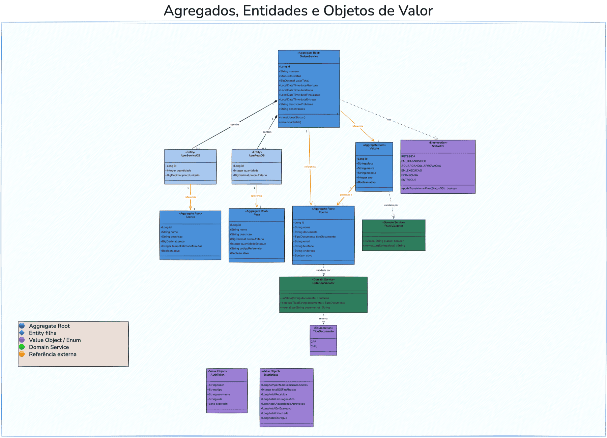

# Agregados, Entidades e Objetos de Valor

---

## Diagrama de Agregados



```
┌──────────────────────────────────────────────────────────┐
│  AGREGADO: OrdemServico                                  │
│  (Fronteira transacional — salvo/carregado como unidade) │
│                                                          │
│  ┌──────────────────────────────────────────────────┐   │
│  │  OrdemServico (Raiz do Agregado)                 │   │
│  │                                                  │   │
│  │  id: Long                                        │   │
│  │  numero: String           ◄── [Value Object]     │   │
│  │  status: StatusOS         ◄── [Enum com lógica]  │   │
│  │  valorTotal: BigDecimal   ◄── [calculado]        │   │
│  │  dataAbertura: LocalDateTime                     │   │
│  │  dataInicio: LocalDateTime                       │   │
│  │  dataFinalizacao: LocalDateTime                  │   │
│  │  dataEntrega: LocalDateTime                      │   │
│  │  descricaoProblema: String                       │   │
│  │  observacoes: String                             │   │
│  │  cliente: Cliente ──────────────────────────────────►│ OUTRO AGREGADO
│  │  veiculo: Veiculo ──────────────────────────────────►│ OUTRO AGREGADO
│  │                                                  │   │
│  │  ┌────────────────────────────────────────────┐  │   │
│  │  │ ItemServicoOS (Entidade filha)             │  │   │
│  │  │  id, quantidade, precoUnitario (snapshot)  │  │   │
│  │  │  servico: Servico ──────────────────────────────►│ REF
│  │  └────────────────────────────────────────────┘  │   │
│  │                                                  │   │
│  │  ┌────────────────────────────────────────────┐  │   │
│  │  │ ItemPecaOS (Entidade filha)                │  │   │
│  │  │  id, quantidade, precoUnitario (snapshot)  │  │   │
│  │  │  peca: Peca ────────────────────────────────────►│ REF
│  │  └────────────────────────────────────────────┘  │   │
│  └──────────────────────────────────────────────────┘   │
└──────────────────────────────────────────────────────────┘

┌──────────────────────────────┐  ┌──────────────────────────────┐
│  AGREGADO: Cliente           │  │  AGREGADO: Veiculo           │
│                              │  │                              │
│  id: Long                    │  │  id: Long                    │
│  nome: String                │  │  placa: String               │
│  documento: String           │  │  marca: String               │
│  tipoDocumento: TipoDocumento│  │  modelo: String              │
│  email: String               │  │  ano: Integer                │
│  telefone: String            │  │  cliente: Cliente ──────────►│
│  endereco: String            │  │  ativo: Boolean              │
│  ativo: Boolean              │  └──────────────────────────────┘
└──────────────────────────────┘

┌──────────────────────────────┐  ┌──────────────────────────────┐
│  AGREGADO: Servico           │  │  AGREGADO: Peca              │
│                              │  │                              │
│  id: Long                    │  │  id: Long                    │
│  nome: String                │  │  nome: String                │
│  descricao: String           │  │  descricao: String           │
│  preco: BigDecimal           │  │  precoUnitario: BigDecimal   │
│  tempoEstimadoMinutos: Int   │  │  quantidadeEstoque: Integer  │
│  ativo: Boolean              │  │  codigoReferencia: String    │
└──────────────────────────────┘  │  ativo: Boolean              │
                                  └──────────────────────────────┘
```

---

## Objetos de Valor (Value Objects)

### StatusOS (Enum com comportamento)

```java
// Encapsula as regras de transição de estado
RECEBIDA.podeTransicionarPara(EM_DIAGNOSTICO)       → true
        EM_DIAGNOSTICO.podeTransicionarPara(FINALIZADA)     → false
        AGUARDANDO_APROVACAO.podeTransicionarPara(EM_DIAGNOSTICO) → true  // rejeição
        ENTREGUE.podeTransicionarPara(qualquer)             → false
```

### Número da OS (Gerado como String)

- Formato: `OS-{ano}-{UUID[0..7]}`
- Exemplo: `OS-2025-A1B2C3D4`
- Imutável após criação

### Preço Snapshot nos Itens

- `ItemServicoOS.precoUnitario` e `ItemPecaOS.precoUnitario`
- Capturado no momento da inclusão na OS
- Não muda se o preço do serviço/peça for alterado posteriormente

### AuthToken (record)

```
Campos: token (String), tipo (String), username (String), role (String), expiresIn (Long)
Imutável após criação. Retornado pelo domínio ao fazer login — nunca expõe UserDetails.
```

### Estatisticas (record)

```
Campos: tempoMedioExecucaoMinutos (Long), totalOSFinalizadas (long),
        totalOSPorStatus_recebida, _emDiagnostico, _aguardandoAprovacao,
        _emExecucao, _finalizada, _entregue (todos long)
Calculado sob demanda por OrdemServicoUseCase.calcularEstatisticas().
```

---

## Serviços de Domínio

### CpfCnpjValidator

```
Responsabilidade: Validar CPF e CNPJ pelo algoritmo oficial da Receita Federal
Métodos:
  - isValido(String documento) → boolean
  - detectarTipo(String documento) → TipoDocumento
  - normalizar(String documento) → String  (remove pontos, traços, barras)
```

### PlacaValidator

```
Responsabilidade: Validar placas de veículos brasileiros
Suporta:
  - Padrão antigo: ABC1234
  - Padrão Mercosul: ABC1D23
Métodos:
  - isValida(String placa) → boolean
  - normalizar(String placa) → String  (maiúsculas, remove hífen)
```

---

## Regras de Negócio Encapsuladas no Domínio

| Regra                           | Onde está encapsulada                                        |
|---------------------------------|--------------------------------------------------------------|
| Transições válidas de status    | `StatusOS.podeTransicionarPara()`                            |
| Registro automático de datas    | `OrdemServico.transicionarStatus()`                          |
| Cálculo do valor total          | `OrdemServico.recalcularTotal()`                             |
| Validação de CPF/CNPJ           | `CpfCnpjValidator`                                           |
| Validação de placa              | `PlacaValidator`                                             |
| Estoque não pode ficar negativo | `OrdemServicoUseCase.validarEstoque()` (private)             |
| Preço snapshot                  | `ItemServicoOS` e `ItemPecaOS` inicializados com preço atual |
| Notificar cliente ao transicionar para `AGUARDANDO_APROVACAO` | `OrdemServicoUseCase` → `EmailPort.enviarNotificacaoOrcamento()` |
