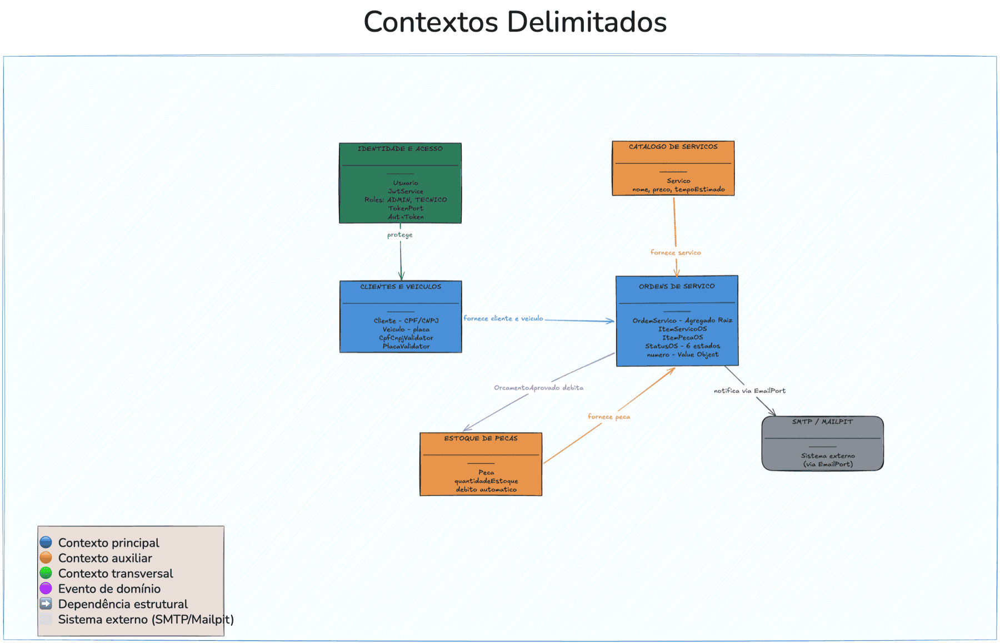

# Contextos Delimitados (Bounded Contexts)

---

## Visão Geral



```
┌─────────────────────────────────────────────────────────────────────────┐
│                        OFICINA MECÂNICA - SISTEMA                       │
│                                                                         │
│  ┌──────────────────────┐     ┌───────────────────────────────────────┐ │
│  │  CLIENTES E VEÍCULOS │     │       ORDENS DE SERVIÇO               │ │
│  │                      │────►│                                       │ │
│  │  • Cliente (CPF/CNPJ)│     │  • OrdemServico (Agregado Raiz)       │ │
│  │  • Veiculo (placa)   │     │  • ItemServicoOS                      │ │
│  │                      │     │  • ItemPecaOS                         │ │
│  │  Entidades:          │     │  • StatusOS (enum)                    │ │
│  │  - Cliente           │     │                                       │ │
│  │  - Veiculo           │     │  Fluxo: RECEBIDA → EM_DIAGNOSTICO     │ │
│  └──────────────────────┘     │         → AGUARDANDO_APROVACAO        │ │
│            ▲                  │         → EM_EXECUCAO                 │ │
│            │                  │         → FINALIZADA → ENTREGUE       │ │
│            │                  └───────────────────────────────────────┘ │
│  ┌──────────────────────┐              │                                 │
│  │  CATÁLOGO DE SERVIÇOS│              │ usa                             │
│  │                      │◄─────────────┤                                 │
│  │  • Servico           │              │                                 │
│  │  • nome, preço,      │     ┌────────▼──────────────────────────────┐ │
│  │    tempoEstimado     │     │     ESTOQUE DE PEÇAS E INSUMOS        │ │
│  └──────────────────────┘     │                                       │ │
│                               │  • Peca (nome, preço, qtdEstoque)    │ │
│  ┌──────────────────────┐     │  • Controle de débito automático      │ │
│  │  IDENTIDADE E ACESSO │     │    na aprovação do orçamento          │ │
│  │                      │     └───────────────────────────────────────┘ │
│  │  • Usuario           │                                               │
│  │  • JWT (Bearer)      │                                               │
│  │  • Roles: ADMIN,     │                                               │
│  │    TECNICO           │                                               │
│  └──────────────────────┘                                               │
└─────────────────────────────────────────────────────────────────────────┘
```

---

## Detalhamento por Contexto

### 1. Clientes e Veículos

**Responsabilidade:** Cadastro e manutenção dos clientes (PF/PJ) e seus veículos.

| Elemento           | Tipo                              | Descrição                                          |
|--------------------|-----------------------------------|----------------------------------------------------|
| `Cliente`          | Entidade                          | Identificada por CPF ou CNPJ                       |
| `Veiculo`          | Entidade                          | Pertence a um `Cliente`, identificada por placa    |
| `TipoDocumento`    | Enum                              | CPF ou CNPJ                                        |
| `CpfCnpjValidator` | Value Object / Serviço de domínio | Valida CPF e CNPJ com algoritmo da Receita Federal |
| `PlacaValidator`   | Value Object / Serviço de domínio | Valida placa padrão antigo e Mercosul              |

**Invariantes:**

- Documento (CPF/CNPJ) deve ser único no sistema
- Placa de veículo deve ser única no sistema
- CPF/CNPJ deve ser matematicamente válido

---

### 2. Gestão de Ordens de Serviço

**Responsabilidade:** Ciclo de vida completo de um atendimento — do recebimento à entrega.

| Elemento        | Tipo                         | Descrição                                      |
|-----------------|------------------------------|------------------------------------------------|
| `OrdemServico`  | **Agregado Raiz**            | Contém todos os dados do atendimento           |
| `ItemServicoOS` | Entidade (parte do agregado) | Serviço incluído na OS com preço snapshot      |
| `ItemPecaOS`    | Entidade (parte do agregado) | Peça incluída na OS com preço snapshot         |
| `StatusOS`      | Enum                         | 6 estados com regras de transição encapsuladas |
| `numero`        | Value Object                 | Identificador legível da OS (ex: OS-2025-A1B2) |
| `EmailPort`     | **Output Port (novo)**       | Interface de domínio para envio de notificações ao cliente; implementada por `JavaMailSenderEmailAdapter` (produção) e `NoOpEmailAdapter` (testes) |

**Invariantes:**

- `valorTotal` é sempre recalculado antes da transição para `AGUARDANDO_APROVACAO`
- Transições de status seguem um fluxo definido (ver `StatusOS.podeTransicionarPara()`)
- `dataInicio` é registrada automaticamente na transição para `EM_EXECUCAO`
- `dataFinalizacao` é registrada automaticamente na transição para `FINALIZADA`
- `dataEntrega` é registrada automaticamente na transição para `ENTREGUE`
- Preços dos itens são capturados (snapshot) no momento da inclusão na OS

**Política crítica:**
> Quando `OrcamentoAprovado` → debitar estoque de cada `ItemPecaOS`  
> Se estoque insuficiente → bloquear aprovação (`EstoqueInsuficienteException`)

---

### 3. Catálogo de Serviços

**Responsabilidade:** Tabela de preços e catálogo dos serviços oferecidos pela oficina.

| Elemento  | Tipo     | Descrição                              |
|-----------|----------|----------------------------------------|
| `Servico` | Entidade | Nome, descrição, preço, tempo estimado |

**Invariantes:**

- `preco` deve ser maior que zero
- `tempoEstimadoMinutos` mínimo de 1 minuto
- Soft delete: serviços inativados permanecem para manter histórico das OS

---

### 4. Estoque de Peças e Insumos

**Responsabilidade:** Controle de peças e insumos, com saldo de estoque.

| Elemento | Tipo     | Descrição                                                         |
|----------|----------|-------------------------------------------------------------------|
| `Peca`   | Entidade | Nome, preço unitário, quantidade em estoque, código de referência |

**Invariantes:**

- `quantidadeEstoque` nunca pode ficar negativo
- Débito ocorre apenas na aprovação do orçamento (não no diagnóstico)
- Soft delete: peças inativadas preservam histórico das OS

---

### 5. Identidade e Acesso

**Responsabilidade:** Autenticação e controle de acesso às APIs administrativas.

| Elemento                 | Tipo                                 | Descrição                                       |
|--------------------------|--------------------------------------|-------------------------------------------------|
| `Usuario`                | Entidade                             | username, senha (BCrypt), role                  |
| `JwtService`             | **Adapter de Infraestrutura**        | Implementa `TokenPort` — gera e valida tokens JWT HS256 |
| `TokenPort`              | **Output Port (novo)**               | Interface de domínio que abstrai a geração de token |
| `AuthToken`              | **Value Object (novo)**              | Record imutável com `token`, `tipo`, `username`, `role`, `expiresIn` |
| `UserDetailsServiceImpl` | Adaptador                            | Integra Spring Security com `UsuarioRepository` |

**Roles:**
| Role | Acesso |
|---|---|
| `ADMIN` | Acesso completo + gestão de usuários |
| `TECNICO` | Acesso às OS e CRUD operacional |
| *(público)* | Somente `GET /api/ordens-servico/{id}/status` |

---

## Mapa de Relacionamentos Entre Contextos

```
IDENTIDADE E ACESSO
        │ (protege)
        ▼
CLIENTES E VEÍCULOS ──────────────────────► ORDENS DE SERVIÇO
                                                    │
                    CATÁLOGO DE SERVIÇOS ───────────┤
                                                    │
                    ESTOQUE DE PEÇAS ───────────────┘
                         ▲
                         │ (débito automático via Política)
                         └── ORDENS DE SERVIÇO (OrcamentoAprovado)

ORDENS DE SERVIÇO ──► [SMTP / Mailpit] (via EmailPort → JavaMailSenderEmailAdapter)
```

**Tipo de integração:** Todos os contextos coexistem no mesmo monolito.  
Comunicação via chamadas diretas de serviço Java. Na Fase 2 foi adicionada integração
com servidor SMTP via Spring Mail (JavaMailSender), abstraída pelo EmailPort — em
ambiente local usa Mailpit; em produção, configurável via variáveis de ambiente.  
Em uma evolução futura para microsserviços, os bounded contexts seriam os candidatos naturais à separação.

---

## Mapeamento para Arquitetura Hexagonal

Cada bounded context é implementado seguindo a Arquitetura Hexagonal (Ports & Adapters): o Adapter REST traduz a
requisição em um Command e chama o Input Port, implementado pelo Use Case, que orquestra o domínio e se comunica
com o mundo externo através dos Output Ports.

| Bounded Context      | Adapter REST (in)        | Input Port              | Use Case              | Output Ports (out)                                                                |
|-----------------------|---------------------------|--------------------------|--------------------------|-----------------------------------------------------------------------------------|
| Clientes e Veículos  | `ClienteController`      | `ClienteInputPort`      | `ClienteUseCase`      | `ClienteRepositoryPort`                                                           |
|                      | `VeiculoController`      | `VeiculoInputPort`      | `VeiculoUseCase`      | `VeiculoRepositoryPort`, `ClienteRepositoryPort`                                  |
| Ordens de Serviço    | `OrdemServicoController` | `OrdemServicoInputPort` | `OrdemServicoUseCase` | `OrdemServicoRepositoryPort`, `ClienteRepositoryPort`, `VeiculoRepositoryPort`, `ServicoRepositoryPort`, `PecaRepositoryPort`, `EmailPort` |
| Catálogo de Serviços | `ServicoController`      | `ServicoInputPort`      | `ServicoUseCase`      | `ServicoRepositoryPort`                                                           |
| Estoque de Peças     | `PecaController`         | `PecaInputPort`         | `PecaUseCase`         | `PecaRepositoryPort`                                                              |
| Identidade e Acesso  | `AuthController`         | `AuthInputPort`         | `AuthUseCase`         | `UsuarioRepositoryPort`, `TokenPort`                                              |

**Princípio aplicado:** Cada camada tem responsabilidade única. Os Adapters REST recebem requisições HTTP e as
traduzem em Commands, delegando ao Input Port. Os Use Cases contêm toda a lógica de negócio e se comunicam com
persistência e serviços externos apenas através dos Output Ports. O Domain encapsula as regras de negócio
(transições de status, cálculo de orçamento) e nunca depende da infraestrutura.

Para mais detalhes sobre a arquitetura, consulte [docs/arquitetura/hexagonal.md](../arquitetura/hexagonal.md).
