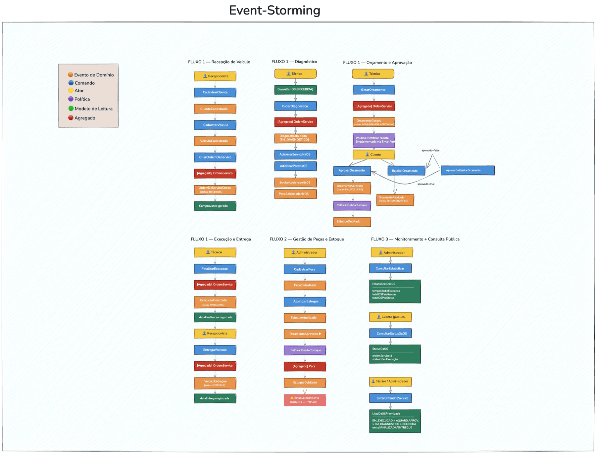

# Event Storming — Oficina Mecânica

> Mapeamento completo dos eventos de domínio, comandos, atores, políticas e modelos de leitura  
> seguindo a notação de Event Storming (Alberto Brandolini).

---

## Legenda de Cores

| Cor                | Tipo                  | Descrição                                             |
|--------------------|-----------------------|-------------------------------------------------------|
| 🟠 **Laranja**     | **Evento de Domínio** | Algo que aconteceu no domínio (passado)               |
| 🔵 **Azul**        | **Comando**           | Intenção de causar uma mudança de estado              |
| 🟡 **Amarelo**     | **Ator**              | Quem dispara o comando                                |
| 🟣 **Lilás**       | **Política**          | Reação automática a um evento ("quando X, então Y")   |
| 🟢 **Verde**       | **Modelo de Leitura** | Dado consultado antes de um comando                   |
| 🔴 **Rosa/Salmão** | **Agregado**          | Entidade raiz que processa o comando e emite o evento |
| ⚠️ **Vermelho**    | **Hotspot**           | Ponto de dúvida ou risco identificado                 |

---



---

> **Padrão Command (Fase 2):** Cada comando do Event Storming corresponde agora a um record Java
> imutável em `domain/port/in/command/`. O Controller traduz o DTO HTTP para o Command antes de
> chamar o caso de uso. Isso garante que o domínio nunca veja DTOs de infraestrutura.
>
> Exemplos: `AbrirOrdemServicoCommand`, `AdicionarItemServicoCommand`, `AprovacaoOrcamentoCommand`

## Fluxo 1 — Criação e Acompanhamento da Ordem de Serviço

### Fase: Recepção do Veículo

```
🟡 Recepcionista
      │
      ▼
🔵 CadastrarCliente (se não existir)
      │
      ▼
🟠 ClienteCadastrado
      │
      ▼
🔵 CadastrarVeiculo
      │
      ▼
🟠 VeiculoCadastrado
      │
      ▼
🔵 CriarOrdemDeServico
      │ (requer: CPF/CNPJ cliente, placa veículo,
      │  descrição do problema, lista de serviços/peças)
      │
🔴 OrdemServico
      │
      ▼
🟠 OrdemDeServicoCriada   [status: RECEBIDA]
      │
      ▼
🟢 Comprovante de recebimento gerado para o cliente
```

**Hotspots:**

- ⚠️ E se o veículo não estiver cadastrado? → Validação obrigatória antes de criar a OS
- ⚠️ E se as peças não tiverem estoque suficiente? → Verificação no momento da criação

---

### Fase: Diagnóstico

```
🟡 Técnico
      │
      ▼
🟢 Consultar OS (status = RECEBIDA)
      │
      ▼
🔵 IniciarDiagnostico
      │
🔴 OrdemServico
      │
      ▼
🟠 DiagnosticoIniciado   [status: EM_DIAGNOSTICO]
      │
      ▼
🔵 AdicionarServicoNaOS   (pode ocorrer N vezes)
🔵 AdicionarPecaNaOS      (pode ocorrer N vezes)
      │
      ▼
🟠 ServicoAdicionadoNaOS
🟠 PecaAdicionadaNaOS
```

**Hotspots:**

- ⚠️ Técnico pode adicionar serviços durante o diagnóstico sem geração de orçamento ainda
- ⚠️ Estoque deve ser verificado ao adicionar peça, mas debitado apenas na aprovação

---

### Fase: Orçamento e Aprovação

```
🟡 Técnico
      │
      ▼
🔵 GerarOrcamento
      │ (recalcula valorTotal = Σ itens)
      │
🔴 OrdemServico
      │
      ▼
🟠 OrcamentoGerado   [status: AGUARDANDO_APROVACAO]
      │
      ▼
🟣 Política: Enviar notificação do orçamento ao cliente
      │
      ▼
🟡 Cliente
      │
      ├──[Aprova]──►🔵 AprovarOrcamento
      │                    │
      │               🔴 OrdemServico
      │                    │
      │                    ▼
      │               🟠 OrcamentoAprovado   [status: EM_EXECUCAO]
      │                    │
      │               🟣 Política: DebitarEstoqueDasPecas
      │                    │
      │                    ▼
      │               🟠 EstoqueDebitado
      │                    │
      │               🟢 dataInicio registrada automaticamente
      │
      └──[Rejeita]──►🔵 RejeitarOrcamento
                           │
                      🔴 OrdemServico
                           │
                           ▼
                      🟠 OrcamentoRejeitado   [status: EM_DIAGNOSTICO]
                           │
                      (volta para fase de diagnóstico)
```

**Comando alternativo — endpoint unificado (Fase 2):**

```
🔵 AprovarOuRejeitarOrcamento  ← NOVO endpoint unificado
      │ (body: { "aprovado": true/false, "observacao": "..." })
      │ POST /api/ordens-servico/{id}/aprovacao-orcamento
      │
      ├── aprovado=true  → mesmo fluxo de AprovarOrcamento
      └── aprovado=false → mesmo fluxo de RejeitarOrcamento
```

**Hotspots:**

- ⚠️ Se o estoque for insuficiente no momento da aprovação → bloquear com erro 422

**Política implementada (Fase 2):**

```
🟣 Política implementada: ao gerar orçamento → EmailPort.enviarNotificacaoOrcamento()
   Adapter: JavaMailSenderEmailAdapter (produção) / NoOpEmailAdapter (testes/local)
```

---

### Fase: Execução e Entrega

```
🟡 Técnico
      │
      ▼
🔵 FinalizarExecucao
      │
🔴 OrdemServico
      │
      ▼
🟠 ExecucaoFinalizada   [status: FINALIZADA]
      │
🟢 dataFinalizacao registrada automaticamente
      │
      ▼
🟡 Recepcionista
      │
      ▼
🔵 EntregarVeiculo
      │
🔴 OrdemServico
      │
      ▼
🟠 VeiculoEntregue   [status: ENTREGUE]
      │
🟢 dataEntrega registrada automaticamente
```

---

### Modelo de Leitura: Acompanhamento pelo Cliente (API Pública)

```
🟡 Cliente (via app/web)
      │
      ▼
🔵 ConsultarStatusDaOS  (endpoint público, sem autenticação)
      │
      ▼
🟢 StatusDaOS
      {
        "ordemServicoId": 42,
        "status": "Em Execução"
      }
```

---

### Modelo de Leitura: Listagem Prioritária de OS (Fase 2)

```
🟡 Técnico / Administrador
      │
      ▼
🔵 ListarOrdensDeServico
      │ (exclui FINALIZADA e ENTREGUE)
      │ (ordena por prioridade: EM_EXECUCAO > AGUARDANDO_APROVACAO > EM_DIAGNOSTICO > RECEBIDA)
      │ (mais antigas primeiro dentro de cada status)
      │
      ▼
🟢 ListaDeOSPrioritizada
      [
        { id, numero, status: "EM_EXECUCAO",          dataAbertura, cliente, veiculo },
        { id, numero, status: "AGUARDANDO_APROVACAO", dataAbertura, cliente, veiculo },
        { id, numero, status: "EM_DIAGNOSTICO",       dataAbertura, cliente, veiculo },
        { id, numero, status: "RECEBIDA",             dataAbertura, cliente, veiculo }
      ]
```

**Regra:** OS com status `FINALIZADA` e `ENTREGUE` não aparecem na listagem padrão —
são consultadas individualmente via `GET /api/ordens-servico/{id}`.

---

## Fluxo 2 — Gestão de Peças e Insumos

### Cadastro de Peças

```
🟡 Administrador
      │
      ▼
🔵 CadastrarPeca
      │ (nome, descrição, preçoUnitario, quantidadeEstoque, codigoReferencia)
      │
      ▼
🟠 PecaCadastrada
      │
      ▼
🔵 AtualizarEstoque  (reposição manual de estoque)
      │
      ▼
🟠 EstoqueAtualizado
```

### Débito Automático de Estoque

```
🟠 OrcamentoAprovado
      │
      ▼
🟣 Política: ParaCadaItemPecaNaOS → DebitarQuantidadeDoEstoque
      │
      ▼
🔴 Peca (aggregate)
      │
      ▼
🟠 EstoqueDebitado
      │
      └─► Se quantidadeEstoque < quantidadeSolicitada:
              🟠 EstoqueInsuficienteDetectado  [BLOQUEIA aprovação — HTTP 422]
```

### Leitura de Estoque

```
🟡 Administrador
      │
      ▼
🔵 ListarPecas / BuscarPecaPorId
      │
      ▼
🟢 RelatorioDePecas
      {
        "id", "nome", "quantidadeEstoque", "precoUnitario", "codigoReferencia"
      }
```

---

## Fluxo 3 — Monitoramento Administrativo

```
🟡 Administrador
      │
      ▼
🔵 ConsultarEstatisticas
      │
      ▼
🟢 EstatisticasDasOS
      {
        "tempoMedioExecucaoMinutos": 180,
        "totalOSFinalizadas": 45,
        "totalOSPorStatus": {
          "recebida": 3,
          "emDiagnostico": 2,
          "aguardandoAprovacao": 1,
          "emExecucao": 5,
          "finalizada": 20,
          "entregue": 14
        }
      }
```

---

## Resumo de Eventos por Contexto

### Contexto: Ordens de Serviço

| Evento                 | Gatilho             | Status Resultante    |
|------------------------|---------------------|----------------------|
| `OrdemDeServicoCriada` | CriarOrdemDeServico | RECEBIDA             |
| `DiagnosticoIniciado`  | IniciarDiagnostico  | EM_DIAGNOSTICO       |
| `OrcamentoGerado`      | GerarOrcamento      | AGUARDANDO_APROVACAO |
| `OrcamentoAprovado`    | AprovarOrcamento ou AprovarOuRejeitarOrcamento(aprovado=true)    | EM_EXECUCAO          |
| `OrcamentoRejeitado`   | RejeitarOrcamento ou AprovarOuRejeitarOrcamento(aprovado=false)   | EM_DIAGNOSTICO       |
| `ExecucaoFinalizada`   | FinalizarExecucao   | FINALIZADA           |
| `VeiculoEntregue`      | EntregarVeiculo     | ENTREGUE             |

### Contexto: Estoque

| Evento                         | Gatilho                 |
|--------------------------------|-------------------------|
| `PecaCadastrada`               | CadastrarPeca           |
| `EstoqueAtualizado`            | AtualizarEstoque        |
| `EstoqueDebitado`              | Política: pós-aprovação |
| `EstoqueInsuficienteDetectado` | Verificação no débito   |

### Contexto: Clientes e Veículos

| Evento              | Gatilho          |
|---------------------|------------------|
| `ClienteCadastrado` | CadastrarCliente |
| `ClienteAtualizado` | AtualizarCliente |
| `VeiculoCadastrado` | CadastrarVeiculo |
| `VeiculoAtualizado` | AtualizarVeiculo |
